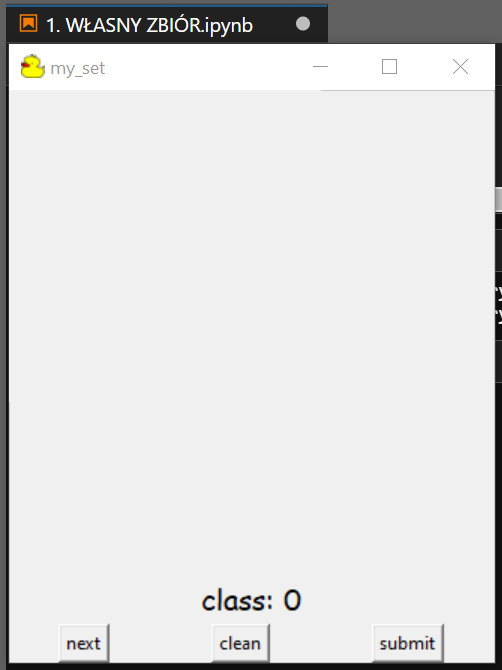
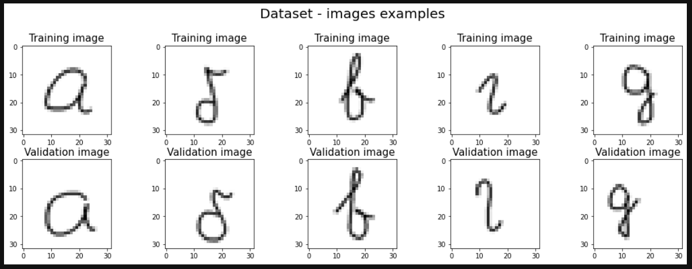
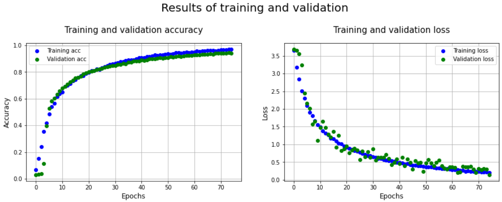
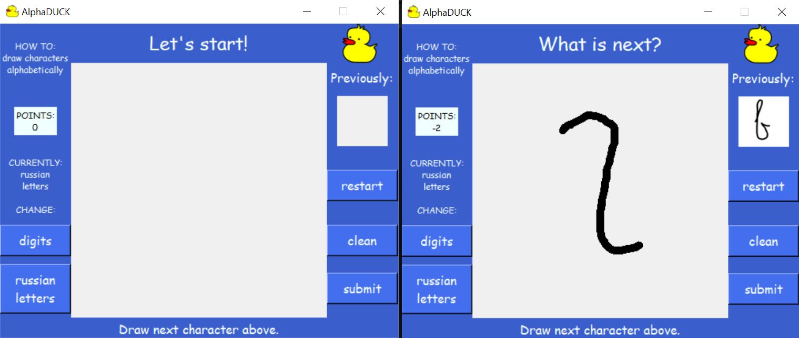

# alpha-duck
Projekt na przedmiot Sztuczna Inteligencja (PB INF sem. 4).

Aplikacja do nauki alfabetu (rosyjskiego). Repozytorium zawiera notatniki do tworzenia swojego zbioru danych, nauki modelu i z samą aplikacją.

# Tworzenie własnego zbioru

Okno do tworzenia własnego zbioru.

# Wyuczony model

Fragment utworzonego zbioru, na którym uczony był model.

Wyniki modelu.

# Aplikacja

Okno aplikacji.

_____________________________

## Źródła wykorzystane przy tworzeniu projektu

example of image classification: https://keras.io/examples/vision/image_classification_from_scratch/

model based on: https://github.com/srijan14/keras-handwritten-character-recognition/blob/master/src/define_model.py

handwritten digits recognition from: https://github.com/bilal-arikan/Keras-Number-Recognition/blob/master/CreateAndTrainModel.py

_____________________________

## Wymagana instalacja:

pip install tensorflow

pip install keras
